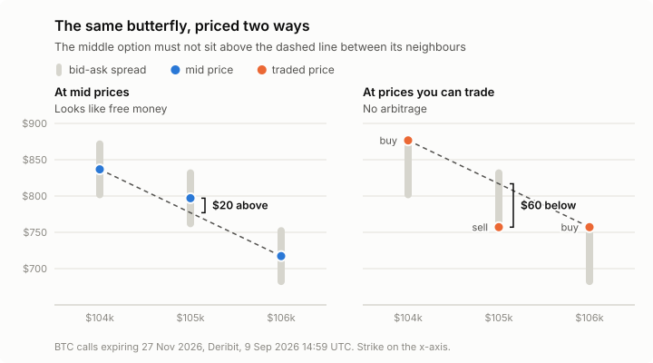

# How much crypto options arbitrage is real?

**Essentially none.** On Deribit, about 1 in 11 option butterflies look like free money at mid prices. But once you account for what you would actually pay and receive - buying at the ask and selling at the bid - the apparent arbitrage disappears.

Option prices have to obey a few rules that follow from arbitrage alone, with no pricing model needed. Quoted prices seem to break them all the time, so I recorded 3.5 days of Deribit's BTC and ETH option books to see whether any of it could actually be traded.

<picture>
  <source media="(prefers-color-scheme: dark)" srcset="docs/figures/violation-rates-dark.svg">
  
</picture>

## Overview

- Built a recorder that saves the full BTC and ETH option books from Deribit's public API every 60 seconds.
- Stored 5.3 million quotes (3.5 days) as Parquet and queried them with DuckDB, without loading everything into memory.
- Wrote my own implied volatility solver (Black-76, Newton's method with a bisection fallback). Its median gap to Deribit's published vols is 0.09 vol points on BTC and 0.16 on ETH.
- Tested every butterfly for arbitrage, then solved a linear program per expiry to check the quotes as a whole.

## How it works

A butterfly is three options with the same expiry at neighbouring strikes. The rule I tested is convexity: the price of the middle option can never be above the straight line joining its two neighbours. If it is, you can sell the middle and buy the outside two for a guaranteed profit.

```math
C(K_2) \le \lambda\, C(K_1) + (1-\lambda)\, C(K_3), \qquad K_2 = \lambda K_1 + (1-\lambda) K_3
```

I checked this rule two ways:

- **Mid prices:** halfway between bid and ask. This is what most analysis uses, but you can't trade at it.
- **Executable prices:** buy at the ask, sell at the bid. This is what you would actually pay.

A violation only counts if it's bigger than one tick (0.0001 of a coin, about $8 on BTC), since rounding prices to the tick grid can create smaller ones on its own.

Checking butterflies one at a time can miss problems spread across many strikes. So for each expiry I also solved a linear program (SciPy / HiGHS) asking whether any arbitrage-free set of prices fits inside all the quoted bid/ask spreads at once.

I fixed the metrics and the result I expected before looking at the data ([ADR 0006](docs/adr/0006-metrics-pre-registered.md)).

<picture>
  <source media="(prefers-color-scheme: dark)" srcset="docs/figures/butterfly-dark.svg">
  
</picture>

## Results

Data: 6,194 snapshots from 6 to 10 September 2026.

| | Butterflies | Arbitrage at mid | Arbitrage at executable |
|---|---|---|---|
| BTC | 2,516,346 | 233,926 (9.30%) | 0 |
| ETH | 2,149,426 | 198,883 (9.25%) | 0 |

- Every one of the 432,809 mid-price violations disappears at executable prices. They only exist because of the bid-ask spread.
- They aren't near misses either. To turn a typical one into real arbitrage, you would need to trade 96% of the way from the bid or ask to the mid, on all three options at once.
- An arbitrage-free surface fit inside the quoted spreads for all 68,627 expiry slices.
- The only executable violations I found were 120 across different expiries (longer-dated options priced below shorter ones). 107 of them happened in one eight-minute window on 8 September, and none lasted more than three minutes. They look like stale quotes rather than a real opportunity, though I didn't prove that quote by quote.

So a strategy backtested on mid prices would find arbitrage that was never there.

## Limitations

- Top of book only, so I can't say how much size any violation would have been good for.
- No fees or margin costs. Adding them would only make the result stronger.
- One exchange. Arbitrage across exchanges is a different question.

## Running it

Requires Python 3.13.

```
pip install -e ".[dev]"
pytest                    # 132 tests
python record.py          # record snapshots every 60s
python load.py            # raw snapshots -> Parquet
python analyse.py         # results tables
```

Raw data isn't committed (about 105 MB per day). Design decisions are written up in [docs/adr](docs/adr/).
