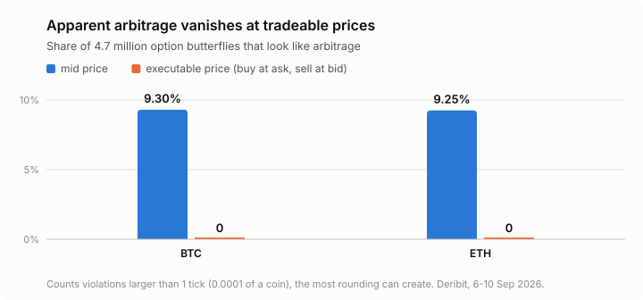

# How much crypto options arbitrage is real?

**Essentially none.** On Deribit, about 1 in 11 option *butterflies* (three options
at neighbouring strikes) look like free money when priced at the *mid* — halfway
between bid and ask. Make every leg trade at the real bid or ask and not one of
4.7 million survives.

- **Question** — some rules on option prices follow from arbitrage alone, with no
  model attached. Quoted prices break them constantly. Is any of it tradeable?
- **Answer** — no. Across 5.3 million quotes over 3½ days, every apparent convexity
  arbitrage vanishes at executable prices, and a single arbitrage-free surface fits
  inside every quoted bid/ask — decided by solving 205,881 linear programs.
- **Why it matters** — any signal or backtest built on mid prices will find
  arbitrage that was never there. The bid-ask spread is not noise around the price;
  it is exactly the room the apparent arbitrage lives in.
- **Why trust it** — the metrics were fixed before the data was analysed, BTC and ETH
  are measured independently, and the one class of executable exception is reported
  and taken apart rather than buried.

<picture>
  <source media="(prefers-color-scheme: dark)" srcset="docs/figures/violation-rates-dark.svg">
  
</picture>

## What I built

- **A recorder** that captures the full BTC and ETH option books from Deribit's public
  API every 60 seconds, into immutable raw files.
- **A DuckDB-over-Parquet pipeline** that queries 5.3 million quotes out of core,
  without loading them into memory.
- **An implied-volatility solver written from scratch** — Black-76 inverted by Newton's
  method, with bisection taking over where vega collapses — checked against the
  `vollib` library in tests, and agreeing with Deribit's own published vols to a
  median 0.09 vol points.
- **A linear program per expiry slice** (SciPy / HiGHS) that decides whether *any*
  arbitrage-free surface fits inside the quotes, and how far the quotes miss by if not.
- **132 tests and 11 architecture decision records** — the reasoning behind each
  design choice, including what each result is and is not allowed to claim.

---

## Headline

Measured over **5,284,244 quotes in 6,194 snapshots** of the full BTC and ETH option
books, 2026-09-06 21:10 to 2026-09-10 12:50 UTC. BTC and ETH are measured
independently throughout.

| | |
|---|---|
| Butterflies tested | **4,665,772** |
| Look like arbitrage at mid prices, above the rounding floor | **432,809** (9.3%) |
| Still arbitrage at executable prices, at any floor | **0** |
| Expiry slices whose quoted bid/ask admits an arbitrage-free surface | **68,627 / 68,627** (100%) |
| Of the spread you would need to capture to collect a typical mid violation | **~96%**, on all three legs at once |
| Executable exceptions found anywhere | **120** cross-expiry anomalies — 107 in one eight-minute episode, none visible for more than three minutes |

The recorder is still running, so the repository's data directory has grown past
this window. The reported window is pinned to a fixed `snapshot_ts` cutoff on
purpose, so that every number on this page describes one population.

---

## The question

Some things about an option price follow from arbitrage alone, with no model
attached — no volatility assumption, no distribution, nothing to disagree about:

- **Convexity in strike.** Three options, same expiry, neighbouring strikes: the
  middle one cannot cost more than the straight line between its neighbours.
- **A bounded calendar.** *Total implied variance* (`w = σ²T`, roughly "how much
  movement is priced in between now and expiry") cannot fall as expiry gets further
  away. More time cannot price in less movement.
- **Collective consistency.** Beyond any individual rule, there must exist one
  arbitrage-free surface that fits inside every quoted bid/ask at once.

When quoted prices break these, it looks like free money. Usually it isn't: the
violation is measured on mid prices, which nobody can trade at, and it evaporates
once you have to buy at the ask and sell at the bid. This project measures exactly
how much evaporates, and what is left.

Terms used throughout:

- **Executable price** — what you would actually get: the ask when you buy, the bid
  when you sell. The strict test.
- **Tick** — Deribit's minimum price increment, 0.0001 of a coin (about $8 on BTC).
- **Materiality floor** — how large a violation must be before it counts. One tick is
  the most that rounding quotes to the tick grid can fabricate on its own, so it is
  the default ([ADR 0008](docs/adr/0008-convexity-is-spacing-weighted-above-a-one-tick-floor.md));
  results are also shown at zero and two ticks.

## How it works

**Convexity is tested on prices, not volatilities.** For strikes K₁ < K₂ < K₃, write
K₂ = λK₁ + (1−λ)K₃. Buying λ of the K₁ call and (1−λ) of the K₃ call while selling one
K₂ call can never pay out less than zero at expiry, so it cannot cost less than zero
today:

```math
C(K_2) \;\le\; \lambda\, C(K_1) + (1-\lambda)\, C(K_3)
```

On mid prices every C is a midpoint. On executable prices the two wings are bought at
the ask and the body is sold at the bid. Weighting by strike spacing matters: Deribit's
strikes are dense near the money and sparse in the wings, and the textbook equal
weights (1, −2, 1) would flag ordinary, perfectly convex prices as violations.

**Collective consistency is a linear program.** Testing butterflies one at a time can
miss an inconsistency spread across many strikes. So for each *slice* — one currency,
one snapshot, one expiry — a single LP asks: is there any set of call and put prices,
each inside its quoted band, that satisfies every static no-arbitrage condition at once?

```math
\begin{aligned}
\min_{C,\,P,\,u,\,v,\,t}\quad & t \\
\text{subject to}\quad & \text{bid}_i - t \;\le\; C_i \;\le\; \text{ask}_i + t \\
& 0 \;\le\; C_i - C_{i+1} \;\le\; v\,(K_{i+1} - K_i) \\
& C_i \;\le\; \lambda_i\, C_{i-1} + (1-\lambda_i)\, C_{i+1} \\
& C_i - P_i \;=\; u - v\,K_i \\
& \max(u - vK_i,\ 0) \;\le\; C_i \;\le\; u, \qquad e^{-T} \le v \le 1, \qquad t \ge 0
\end{aligned}
```

Line by line: prices stay within the quotes, widened by `t`; calls get cheaper as the
strike rises, but never by more than the discounted strike gap; convexity; put-call
parity wherever both are quoted; and price bounds. Puts mirror each call condition.
`v` is the discount factor and `u = vF` the discounted forward. Both are left free, so
the program needs no interest rate or forward from outside
([ADR 0011](docs/adr/0011-the-forward-is-implied-from-parity.md)).

The optimum `t*` is how far the quotes must widen before an arbitrage-free surface fits;
`t* = 0` means it already does. The program is solved with HiGHS 205,881 times: once
per slice, on each of three price bases.

**Nothing is joined across time.** Every test compares quotes from a single API call,
so every price in it was live at the same instant
([ADR 0003](docs/adr/0003-never-join-across-snapshots.md)).

## What was fixed in advance

Pre-registration matters here because the interesting outcome is a null result, and
a null result is easy to manufacture after the fact by re-cutting the data. Full text
in [ADR 0006](docs/adr/0006-metrics-pre-registered.md) and
[ADR 0010](docs/adr/0010-band-feasibility-is-pre-registered.md).

| | Committed to before running |
|---|---|
| **Primary** | Share of butterflies violating convexity, on mid and on executable, and the ratio between them — the *illusion share* |
| **Primary (bands)** | Share of slices whose quoted band admits an arbitrage-free surface, and how far it must widen where it does not |
| **Secondary** | Persistence of executable violations across consecutive snapshots; calendar rates; agreement with Deribit's `mark_iv` |
| **Expected** | Executable violations approximately zero; mid violations explained by spread width. A publishable outcome, not a failure |
| **Robustness** | BTC and ETH computed independently. Disagreement reported, not reconciled |

---

## Results

### 1. Convexity — all of the apparent arbitrage is spread illusion

Counted first on mid prices, then on executable prices, over the same butterflies.

| | butterflies | violating at mid | violating executable | illusion share |
|---|---|---|---|---|
| BTC | 2,516,346 | 233,926 (9.30%) | **0** | **100%** |
| ETH | 2,149,426 | 198,883 (9.25%) | **0** | **100%** |

The *illusion share* is the pre-registered primary metric: the fraction of apparent
arbitrage that exists only because mid prices cannot be traded. It is **exactly 100%**,
on both underlyings and at every materiality floor — including a floor of zero, where
any positive violation counts, however small.

| materiality floor | mid, BTC | mid, ETH | executable |
|---|---|---|---|
| 0 ticks | 413,469 (16.43%) | 289,193 (13.45%) | **0** |
| 1 tick | 233,926 (9.30%) | 198,883 (9.25%) | **0** |
| 2 ticks | 124,446 (4.95%) | 131,325 (6.11%) | **0** |

This is the null result pre-registered above, and it is the expected one. Persistence
is undefined for convexity, since nothing survived to persist. It is measured for the
calendar exceptions in section 3.

### 2. Band feasibility — one surface fits inside every executable band

| basis | BTC clean | ETH clean | median `t*` where it fails |
|---|---|---|---|
| **executable** (bid to ask) | 34,316 / 34,316 (**100%**) | 34,311 / 34,311 (**100%**) | — |
| mark (Deribit's own fitted price) | 0.017% | 0.035% | 0.16 / 0.09 ticks |
| mid (the midpoint) | 0.003% | 0.070% | 3.16 / 4.21 ticks |

Mid and mark are *zero-width* bands — a single price rather than a range — so failing is
close to definitional for them, which [ADR 0010](docs/adr/0010-band-feasibility-is-pre-registered.md)
states in advance. The informative quantity is the **size** of the miss, and it forms a
ladder: raw midpoints need three to four ticks of room, Deribit's own fitted mark surface
needs about a tenth of a tick, and the real quoted band needs none. A detector that could
not see arbitrage would not put those three in that order.

**Is 100% clean just a wide band?** No. The executable half-spread has a median of
**7.50 ticks** on both underlyings, against the 3.16 / 4.21 ticks the mid surface needs.
The room required is roughly half the room the market quotes, and in **83%** (BTC) and
**79%** (ETH) of slices the required widening fits inside the spread outright. There is
headroom, but it is not a landslide.

<details>
<summary>Exclusions</summary>

8 BTC and 2 ETH slices have too few strikes to set up the program at all, and are left
out of the denominator on every basis. Separately, 33 to 52 violating slices per basis
(mid and mark) have no strike quoted as both a call and a put, hence no parity forward
to express their miss in ticks. They stay in the clean share and are counted separately.

</details>

### 3. Calendar — the only executable exceptions, and they are not trades

Total implied variance must not fall as expiry lengthens. Strikes do not line up between
expiries, so the far expiry is interpolated across the overlap only, never extrapolated.
The tradeable direction sells the near expiry at its bid and buys the far at its ask —
the direction that makes a violation hardest to find.

| basis | BTC | ETH |
|---|---|---|
| mid | 8,732 / 1,028,363 (0.849%) | 8,569 / 897,529 (0.955%) |
| executable | 13 / 904,677 (0.0014%) | 107 / 785,207 (0.0136%) |

Those 120 are the only executable violations anywhere in this project, and the calendar
is the only cross-expiry test here — the band program works one expiry at a time, so
nothing else could have caught them.

They are not rounding noise: the median shortfall is 30% of the far expiry's total
variance, and the largest is 21x it. But they are not trades either:

- **They are concentrated.** 107 of the 120 fall inside one eight-minute episode, 8
  September 08:46–08:53 UTC, spanning both books. All 120 sit in 15 expiry pairs across
  12 of the 6,194 snapshots.
- **They do not persist.** Tracked by currency, expiry pair and strike, the 120 are 55
  distinct violations. None is visible for more than three consecutive one-minute
  snapshots; the median is two, and 16 appear once and are gone.

Inversions this large, bunched into a few minutes and gone within three, look like stale
or broken quotes, not a standing edge. Confirming that quote by
quote is not attempted here.

### 4. The vol solver against Deribit's published `mark_iv`

A check that the solver inverts the same prices Deribit thinks it is quoting. Median
absolute gap **0.089 vol points** on BTC (2,564,971 quotes, p90 1.76) and **0.157** on
ETH (2,174,797 quotes, p90 3.13). Quotes the solver could not invert are counted, not
silently dropped: 88,655 and 111,875 respectively.

---

## Secondary, descriptive — added after the primary result

The metric below was written **after** the primary result was known. It restates that
result in different units and cannot change it, which is what makes it admissible at
all; the rule is set out in
[ADR 0009](docs/adr/0009-secondary-metrics-added-after-the-primary-result.md).

### How close is a mid violation to being real?

"Zero executable violations" is a count. Here is the same fact as a distribution: how
far from the *touch* (the best bid or ask) toward the midpoint would you need to trade —
on **all three legs at once** — before an apparent mid violation became free money?
0% means trading at the touch is enough. 100% means you would need the midpoint itself,
which is to say the violation was never there.

| | median | p10 (the most nearly-tradeable tenth) | n |
|---|---|---|---|
| BTC | **95.77%** | 86.49% | 233,926 |
| ETH | **96.30%** | 88.24% | 198,883 |

Even the most nearly-tradeable tenth needs roughly seven eighths of the spread on every
leg. Nothing in this distribution is close to the touch.

It is also **flat** where you might hope it varied — no useful signal across tenor
(94.6%–96.8%) or moneyness (93.8%–97.4%). It moves with exactly one thing, the spread
itself:

| executable spread | BTC median capture needed | n |
|---|---|---|
| < 2 ticks | **28.6%** | 55 |
| 2–5 ticks | 70.0% | 994 |
| 5–20 ticks | 85.7% | 21,920 |
| 20–100 ticks | 96.0% | 155,314 |
| 100+ ticks | 96.9% | 55,643 |

That is the mechanism stated plainly: the apparent arbitrage *is* the spread. Where the
spread is genuinely tight the requirement collapses — but that bucket is 55 butterflies
out of 2.5 million, a curiosity rather than a strategy.

---

## What it adds up to

On a liquid crypto options venue, static arbitrage visible on mid prices is an artefact
of pricing at midpoints nobody trades at. Every one of roughly 430,000 material convexity
violations disappears once each leg must cross the spread, and one arbitrage-free surface
fits inside every executable band on both underlyings. The only executable exceptions
are a brief, concentrated burst of cross-expiry anomalies that look like stale quotes.

What that means in practice:

- **For research:** a static-arbitrage signal backtested on mid prices will report edge
  that cannot be traded. Executable prices are the only honest test.
- **For reading a quoted book:** taken as a whole, the book is arbitrage-free at the
  prices it can actually be traded at. The quoted half-spread is roughly twice the
  widening the mid prices need to become consistent.
- **For where an edge could still be:** not in static no-arbitrage conditions on a single
  liquid venue. What is left lives in what this project deliberately does not model —
  depth, fees, speed and other venues.

## Limitations

Stated up front rather than left for the reader to find.

- **Top of book only.** Depth is not recorded, so no violation is tested against size.
  A violation that exists for 0.1 contracts is not a business.
- **No costs.** Fees, margin and the capital cost of holding to expiry are not modelled.
  All three make the executable result stricter, not looser.
- **One venue.** Deribit only. Cross-exchange violations are a different and much
  larger question.
- **Static conditions only.** This tests what arbitrage alone implies. It says nothing
  about whether the surface is *well* priced.

## Reproduce

Requires Python 3.13.

```
pip install -e ".[dev]"
pytest                      # 132 tests
python record.py            # record snapshots every 60s until interrupted
python record.py --once     # or take a single snapshot, as a smoke test
python check.py             # is the recorder collecting correctly?
python load.py              # raw snapshots -> Parquet
python analyse.py           # the results tables, over whatever you have recorded
```

The data is not committed (about 105 MB of raw snapshots per day), so a fresh run
measures its own window rather than this one. Quotes arrive in coin, not USD — the main
unit hazard in the project, converted at exactly one point in the code. The calendar
step is the one part of the analysis that is not yet out of core: it holds a whole price
basis in memory, and at this dataset size it ran out of memory on a 16 GB machine.

## Design

- [CONTEXT.md](CONTEXT.md) — the vocabulary this project uses precisely
- [docs/adr/](docs/adr/) — why the architecture is the way it is, including the
  decisions that constrain what the results above are allowed to claim
